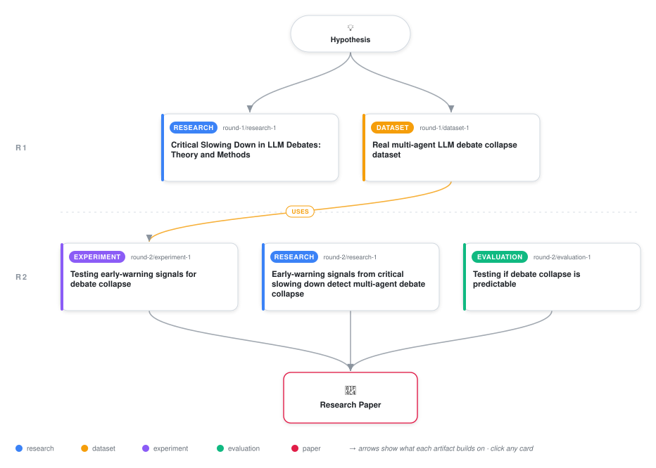

# Testing Critical Slowing Down as an Early Warning Signal for Multi-Agent LLM Debate Collapse

<div align="center">

<a href="https://cdn.jsdelivr.net/gh/AMGrobelnik/ai-invention-eb7b29-testing-critical-slowing-down-as-an-earl@main/workflow.svg">
<picture>
  <source media="(prefers-color-scheme: dark)" srcset="workflow-dark.svg">
  
</picture>
</a>

<sub>🖱️ <b><a href="https://cdn.jsdelivr.net/gh/AMGrobelnik/ai-invention-eb7b29-testing-critical-slowing-down-as-an-earl@main/workflow.svg">Open the interactive diagram</a></b> — every card links to its artifact folder.</sub>

</div>

> **TL;DR** — We tested whether critical slowing down (CSD)—a generic early-warning signal from ecology—predicts multi-agent LLM debate collapse. Using 95 real debates from the DEBATE corpus and rigorous cross-validation, we find the hypothesis is not supported: CSD classifiers achieve AUC=0.49 (chance level), significantly underperforming naive agreement thresholds (AUC=0.586) and spectral models (AUC=0.587). Permutation tests find no significant pre-collapse autocorrelation rise (p=0.554) and only marginal variance rise (p=0.099). This negative result contributes methodologically by (1) establishing proper evaluation protocols for early-warning hypotheses on short time series, (2) demonstrating that simple agreement-level features already capture collapse-predictive signal, and (3) identifying boundary conditions explaining transfer failure: agreement score discretization, extremely short debate trajectories (3–7 rounds), absence of external perturbations, and unconfirmed bistability. Future work should pursue perturbation experiments, longer debate sequences, and multi-model generalization.

<details>
<summary>Full hypothesis</summary>

In multi-agent LLM debate, the ecological 'critical slowing down' (CSD) signature — a directional rise in lag-1 autocorrelation and rolling variance of the round-by-round inter-agent agreement trajectory — does NOT provide a usable early-warning signal for debate collapse under the tested conditions (short, exactly-7-round, discretized-agreement, single-model-family, binary-choice debates from the Multi-Agent-LLMs/DEBATE corpus). Cross-validated evaluation on 95 debates (45 converged, 45 collapsed, 665 round-level rows) shows the CSD classifier performs at chance (AUC=0.490, SD=0.037, 90% recall/0% specificity — it flags almost everything as collapse), while a naive round-1 agreement-threshold baseline (AUC=0.586) and a spectral-contagion baseline (AUC=0.587) both clearly outperform it; feature ablation shows autocorrelation-only (AUC=0.464) is worse than variance-only (0.529), and combining both degrades to the chance-level 0.490. Block-shuffled permutation tests on the full dataset find no significant pre-collapse rise in autocorrelation (p=0.554, but badly underpowered: n=11 collapse vs n=4 convergence usable trajectories after excluding NaN-constant segments) and only a marginal, underpowered variance rise (p=0.099, better powered at n=250/n=225) that is directionally consistent with CSD but does not reach significance and has not yet been checked for robustness on the label-noise-excluded 'clean' dataset. The claim is now a SCOPED NEGATIVE RESULT, not a general claim about LLM debate: failure is attributed to identifiable boundary conditions — agreement is a discretized k-of-n fraction that saturates at 1.0 within 2-3 rounds (68-84% of debates sit in a 'flat/no-variation' PSD regime), trajectories are only 3-7 rounds (far below the dozens-to-hundreds used in ecological EWS studies), there is no external perturbation/recovery-testing analogous to ecological forcing, and bistability of the agreement dynamics has never been directly confirmed (only assumed from the theoretical model). The hypothesis explicitly leaves open — as an untested boundary — whether CSD would transfer under longer debates (10-30 rounds), continuous-valued agreement metrics (e.g., embedding cosine similarity rather than exact-match voting), multi-model-family pools, or debates with genuine external perturbation/verification steps; it does not generalize the negative finding beyond the tested corpus and protocol family.

</details>

[](https://cdn.jsdelivr.net/gh/AMGrobelnik/ai-invention-eb7b29-testing-critical-slowing-down-as-an-earl@main/paper.pdf) [](https://github.com/AMGrobelnik/ai-invention-eb7b29-testing-critical-slowing-down-as-an-earl/tree/main/paper_latex)

This repository contains all **5 artifacts** produced across **2 rounds** of an autonomous AI research run — round by round, exactly in the order they were invented.

## Round 1

| Artifact | Type | Demo | Source | Builds on |
|----------|------|------|--------|-----------|
| **[Critical Slowing Down in LLM Debates: Theory and Methods](https://github.com/AMGrobelnik/ai-invention-eb7b29-testing-critical-slowing-down-as-an-earl/tree/main/round-1/research-1)** | [](https://github.com/AMGrobelnik/ai-invention-eb7b29-testing-critical-slowing-down-as-an-earl/tree/main/round-1/research-1) | [](https://github.com/AMGrobelnik/ai-invention-eb7b29-testing-critical-slowing-down-as-an-earl/blob/main/round-1/research-1/demo/research_demo.md) | [](https://github.com/AMGrobelnik/ai-invention-eb7b29-testing-critical-slowing-down-as-an-earl/tree/main/round-1/research-1/src) | — |
| **[Real multi-agent LLM debate collapse dataset](https://github.com/AMGrobelnik/ai-invention-eb7b29-testing-critical-slowing-down-as-an-earl/tree/main/round-1/dataset-1)** | [](https://github.com/AMGrobelnik/ai-invention-eb7b29-testing-critical-slowing-down-as-an-earl/tree/main/round-1/dataset-1) | [](https://colab.research.google.com/github/AMGrobelnik/ai-invention-eb7b29-testing-critical-slowing-down-as-an-earl/blob/main/round-1/dataset-1/demo/data_code_demo.ipynb) | [](https://github.com/AMGrobelnik/ai-invention-eb7b29-testing-critical-slowing-down-as-an-earl/tree/main/round-1/dataset-1/src) | — |

## Round 2

| Artifact | Type | Demo | Source | Builds on |
|----------|------|------|--------|-----------|
| **[Early-warning signals from critical slowing down detect mult…](https://github.com/AMGrobelnik/ai-invention-eb7b29-testing-critical-slowing-down-as-an-earl/tree/main/round-2/research-1)** | [](https://github.com/AMGrobelnik/ai-invention-eb7b29-testing-critical-slowing-down-as-an-earl/tree/main/round-2/research-1) | [](https://github.com/AMGrobelnik/ai-invention-eb7b29-testing-critical-slowing-down-as-an-earl/blob/main/round-2/research-1/demo/research_demo.md) | [](https://github.com/AMGrobelnik/ai-invention-eb7b29-testing-critical-slowing-down-as-an-earl/tree/main/round-2/research-1/src) | — |
| **[Testing early-warning signals for debate collapse](https://github.com/AMGrobelnik/ai-invention-eb7b29-testing-critical-slowing-down-as-an-earl/tree/main/round-2/experiment-1)** | [](https://github.com/AMGrobelnik/ai-invention-eb7b29-testing-critical-slowing-down-as-an-earl/tree/main/round-2/experiment-1) | [](https://colab.research.google.com/github/AMGrobelnik/ai-invention-eb7b29-testing-critical-slowing-down-as-an-earl/blob/main/round-2/experiment-1/demo/method_code_demo.ipynb) | [](https://github.com/AMGrobelnik/ai-invention-eb7b29-testing-critical-slowing-down-as-an-earl/tree/main/round-2/experiment-1/src) | <sub><i>uses:</i><br/>[dataset‑1&nbsp;(R1)](https://github.com/AMGrobelnik/ai-invention-eb7b29-testing-critical-slowing-down-as-an-earl/tree/main/round-1/dataset-1)</sub> |
| **[Testing if debate collapse is predictable](https://github.com/AMGrobelnik/ai-invention-eb7b29-testing-critical-slowing-down-as-an-earl/tree/main/round-2/evaluation-1)** | [](https://github.com/AMGrobelnik/ai-invention-eb7b29-testing-critical-slowing-down-as-an-earl/tree/main/round-2/evaluation-1) | [](https://colab.research.google.com/github/AMGrobelnik/ai-invention-eb7b29-testing-critical-slowing-down-as-an-earl/blob/main/round-2/evaluation-1/demo/eval_code_demo.ipynb) | [](https://github.com/AMGrobelnik/ai-invention-eb7b29-testing-critical-slowing-down-as-an-earl/tree/main/round-2/evaluation-1/src) | — |

## Repository Structure

Artifacts are grouped by the round of invention that produced them. Each
artifact has its own folder with source code and a self-contained demo:

```
.
├── round-1/                         # One folder per round of invention
│   ├── experiment-1/
│   │   ├── README.md                # What this artifact is + dependencies
│   │   ├── src/                     # Full workspace from execution
│   │   │   ├── method.py            # Main implementation
│   │   │   ├── method_out.json      # Full output data
│   │   │   └── ...                  # All execution artifacts
│   │   └── demo/                    # Self-contained demo
│   │       └── method_code_demo.ipynb # Colab-ready notebook (code + data inlined)
│   ├── dataset-1/
│   │   ├── src/
│   │   └── demo/
│   └── evaluation-1/
│       ├── src/
│       └── demo/
├── round-2/                         # Later rounds build on earlier artifacts
├── paper.pdf                        # Research paper
├── paper_latex/                     # LaTeX source files
├── workflow.svg                     # Artifact dependency diagram (this page's header)
└── README.md
```

## Running Notebooks

### Option 1: Google Colab (Recommended)

Click the "Open in Colab" badges above to run notebooks directly in your browser.
No installation required!

### Option 2: Local Jupyter

```bash
# Clone the repo
git clone https://github.com/AMGrobelnik/ai-invention-eb7b29-testing-critical-slowing-down-as-an-earl
cd ai-invention-eb7b29-testing-critical-slowing-down-as-an-earl

# Install dependencies
pip install jupyter

# Run any artifact's demo notebook
jupyter notebook <artifact_folder>/demo/
```

## Source Code

The original source files are in each artifact's `src/` folder.
These files may have external dependencies - use the demo notebooks for a self-contained experience.

---
*Generated by AI Inventor Pipeline - Automated Research Generation*
